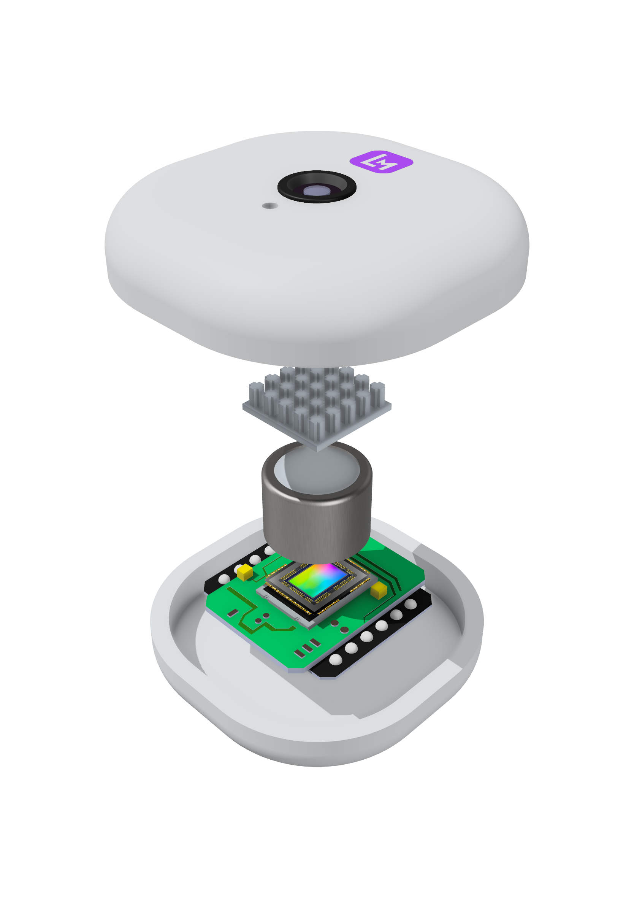

# NeuroMem - AI-Powered Memory Enhancement Device



## 🧠 Project Overview

NeuroMem is a revolutionary wearable device that combines low-cost hardware, neuromorphic optical encryption, and multimodal AI to create an intelligent memory enhancement system. The device automatically captures and analyzes daily experiences, creating a searchable memory graph of people, events, locations, and relationships.

### Key Innovation
- **Neuromorphic Optical Encryption**: Facial features are encoded using neural networks without storing actual images - ensuring complete privacy while enabling AI recognition
- **Ultra-Low Power Design**: Advanced compression algorithms enable all-day recording with minimal battery consumption
- **Multimodal AI Analysis**: Real-time processing of visual and audio data to create structured memory graphs

## 🎯 Market Opportunity

**Target Market Size**: $380B+ wearable technology market by 2028
**Total Addressable Market**: 2.1B potential users worldwide
**Primary Growth Driver**: 47% of adults 30+ report memory concerns

### Target User Segments

1. **Students & Researchers** - PhD students, academics processing vast amounts of information
2. **Business Leaders** - Executives managing multiple meetings and strategic decisions  
3. **Healthcare Professionals** - Medical staff requiring detailed patient interaction records
4. **Seniors & Caregivers** - Adults experiencing memory concerns and their families

## 🚀 Core Features

### 🔒 Privacy-First Design
- Neuromorphic optical encryption protects user identity
- Facial recognition without storing actual facial images
- Irreversible encoding ensures data cannot be reconstructed
- Local processing with optional encrypted cloud sync

### 🎥 Advanced Capture System
- Ultra-compact micro camera with optical compression
- High-fidelity microphone array with noise cancellation
- All-day recording capability with minimal power consumption
- Real-time data compression and encoding

### 🤖 AI-Powered Analysis
- Multimodal AI processes visual and audio simultaneously
- Automatic generation of structured memory graphs
- Natural language search across all recorded experiences
- Intelligent insights, summaries, and reminders

### ⚡ Technical Specifications
- **Power Consumption**: <50mW average (24+ hour battery life)
- **Storage**: Optical compression achieving 100:1 ratio
- **Processing**: Edge AI with neuromorphic computing
- **Connectivity**: Bluetooth 5.0, Wi-Fi 6, optional cellular
- **Form Factor**: Lightweight wearable (<20g)

## 🛠 Technology Stack

### Hardware Components
- Custom micro camera module with optical encoder
- MEMS microphone array
- ARM Cortex-M processor with NPU
- Ultra-low power memory and storage
- Rechargeable Li-ion battery system
- Wireless communication modules

### Software Architecture
- Real-time edge AI processing
- Multimodal deep learning models
- Encrypted data pipeline
- Cross-platform mobile apps
- Cloud-based analysis and backup

### AI Models
- Computer vision for scene understanding
- Speaker diarization and speech recognition
- Natural language processing for content analysis
- Knowledge graph generation and reasoning
- Personalized recommendation engine

## 🏢 Business Model

### Revenue Streams
1. **Hardware Sales**: Premium wearable device ($299-$499)
2. **Subscription Services**: AI analysis and cloud storage ($9.99-$19.99/month)
3. **Enterprise Solutions**: Custom deployments for healthcare, education
4. **Developer API**: Third-party integration platform

### Go-to-Market Strategy
1. **Phase 1**: Direct-to-consumer via online sales
2. **Phase 2**: Retail partnerships and enterprise pilots  
3. **Phase 3**: Healthcare and education market expansion
4. **Phase 4**: International markets and platform licensing

## 📊 Financial Projections

### Funding Requirements (12 months)
- **Hardware Development**: $150K
  - Component sourcing and prototyping
  - Manufacturing setup and tooling
  - Quality assurance and testing
- **Software Development**: $200K
  - AI model development and training
  - Mobile app and cloud infrastructure  
  - Security and encryption implementation
- **Operations**: $100K
  - Cloud computing and AI training costs
  - Legal, patents, and regulatory compliance
  - Marketing and business development
- **Team**: $250K
  - Software engineer (AI/ML focus)
  - Hardware engineer (embedded systems)
  - Sales and marketing specialist

**Total Funding Need**: $700K for first 12 months

### Revenue Projections
- **Year 1**: $500K (1,000 units + early subscribers)
- **Year 2**: $5M (10,000 units + 5,000 subscribers)  
- **Year 3**: $25M (50,000 units + 30,000 subscribers)

## 🏆 Competitive Advantage

### Why We Can Win
1. **Technical Innovation**: Unique neuromorphic optical encryption
2. **Privacy Focus**: True privacy-preserving AI unlike competitors
3. **Team Expertise**: Computational imaging + AI + Big Tech + Startup experience
4. **Market Timing**: Convergence of AI, privacy concerns, and memory enhancement needs
5. **Patent Portfolio**: Core IP in optical encryption and compression

### Key Competitors
- **Rewind AI**: Software-only, no privacy protection
- **Limitless**: Audio-only, lacks visual context
- **Traditional Wearables**: No AI memory analysis

### Our Differentiation
- ✅ Video + Audio capture vs audio-only solutions
- ✅ Hardware-level encryption vs software privacy
- ✅ All-day battery life vs frequent charging
- ✅ Structured memory graphs vs simple recordings

## 🔬 Research & Development

### Current Status
- ✅ Proof-of-concept prototype completed
- ✅ Core AI models trained and tested
- ✅ Patent applications filed for key innovations
- 🔄 Hardware miniaturization in progress
- 🔄 Mobile app development underway
- 🔄 Security audit and compliance review

### Next Milestones
- **Q2 2025**: Alpha prototype testing with select users
- **Q3 2025**: Beta launch and pre-order campaign  
- **Q4 2025**: Manufacturing partnerships and supply chain
- **Q1 2026**: Commercial product launch

## 🌟 Vision & Impact

### Long-term Vision
**"Enhance human cognitive abilities through seamless AI integration"**

We envision a future where:
- Memory limitations no longer constrain human potential
- Privacy-preserving AI augments rather than replaces human intelligence  
- Wearable technology becomes as essential as smartphones
- Aging populations maintain cognitive independence longer

### Social Impact
- **Accessibility**: Helping individuals with memory impairments
- **Education**: Enhanced learning and knowledge retention
- **Healthcare**: Better patient care through detailed interaction records
- **Research**: Accelerating scientific discovery through perfect recall

## 📞 Contact

**Website**: [Your GitHub Pages URL]
**Email**: [Your Email]
**LinkedIn**: [Your LinkedIn]
**Twitter**: [Your Twitter]

## Member


---

## 🚀 Getting Started

This repository contains the landing page for NeuroMem. To view locally:

```bash
git clone [your-repo-url]
cd neuromem-website
# Open index.html in your browser or serve with:
python -m http.server 8000
```

## 📄 License

This project is licensed under the MIT License - see the [LICENSE](LICENSE) file for details.

---

*Enhancing human memory through AI innovation.* 🧠✨